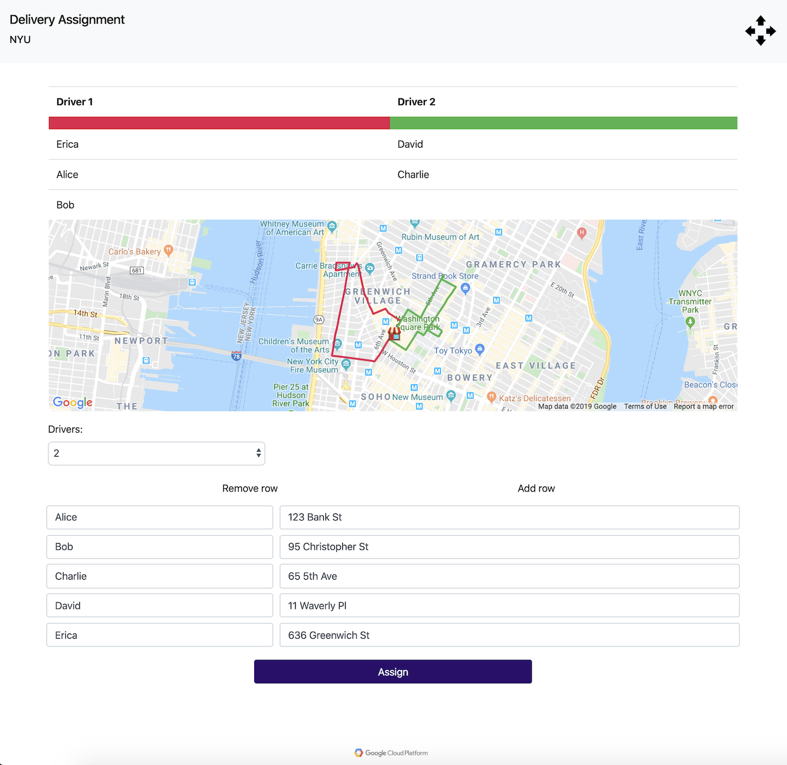

# Delivery Assignment
Efficiently divide deliveries among available drivers.

Demonstration: https://brayvid.github.io/misc/delivery

## License
&copy; 2019 Blake Rayvid. Non-commercial use only.

## Requirements
html, js, css, jquery, bootstrap & google maps js api.

## Directory
* `index.html`
* `README.md`
* `src/`
    * `delivery.js`
    * `prefs.js`
* `img/`
    * `cloud.png`
    * `example.png`
    * `home.png`
    * `logo.png`

## Example

